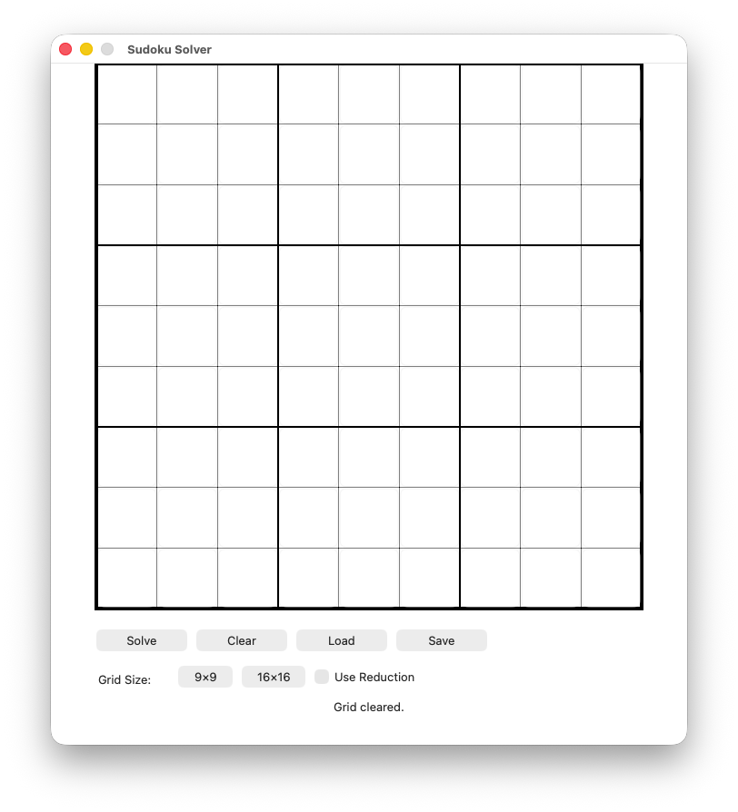
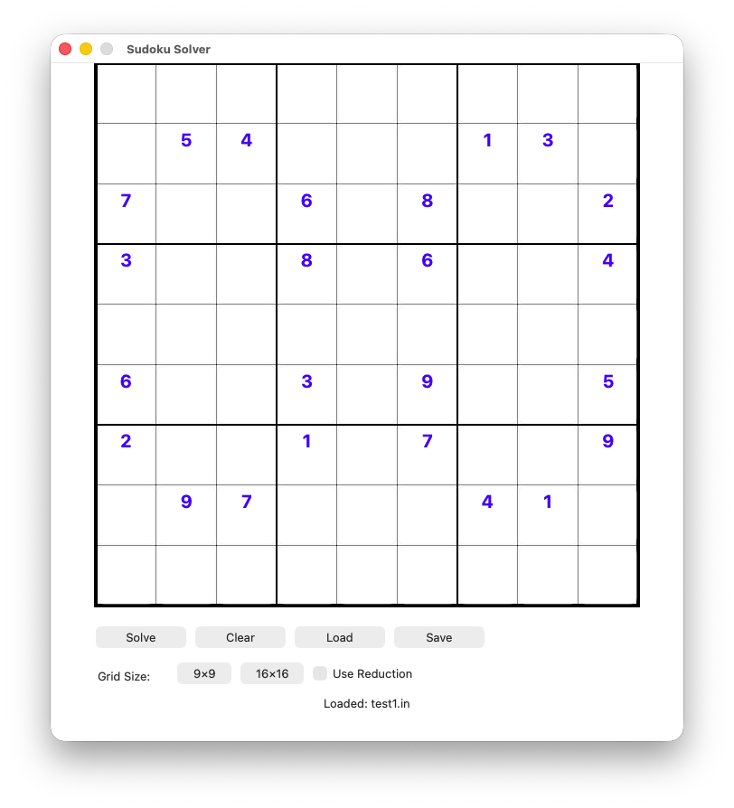
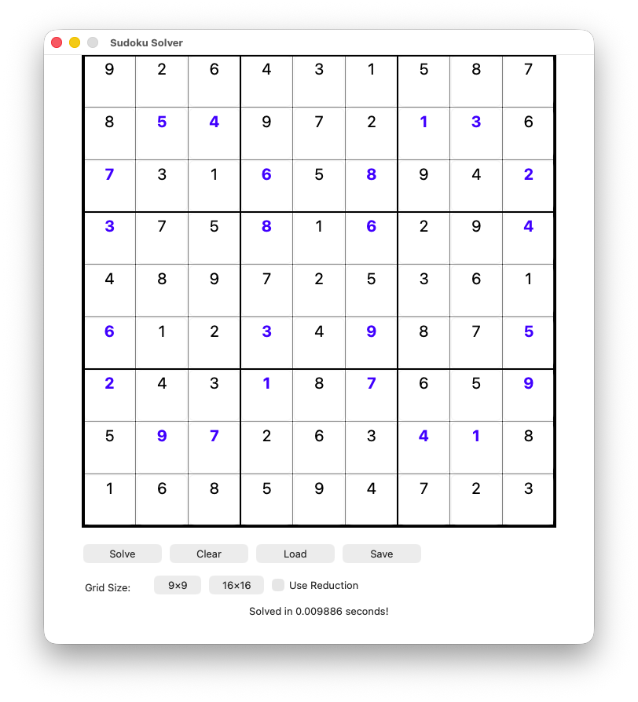
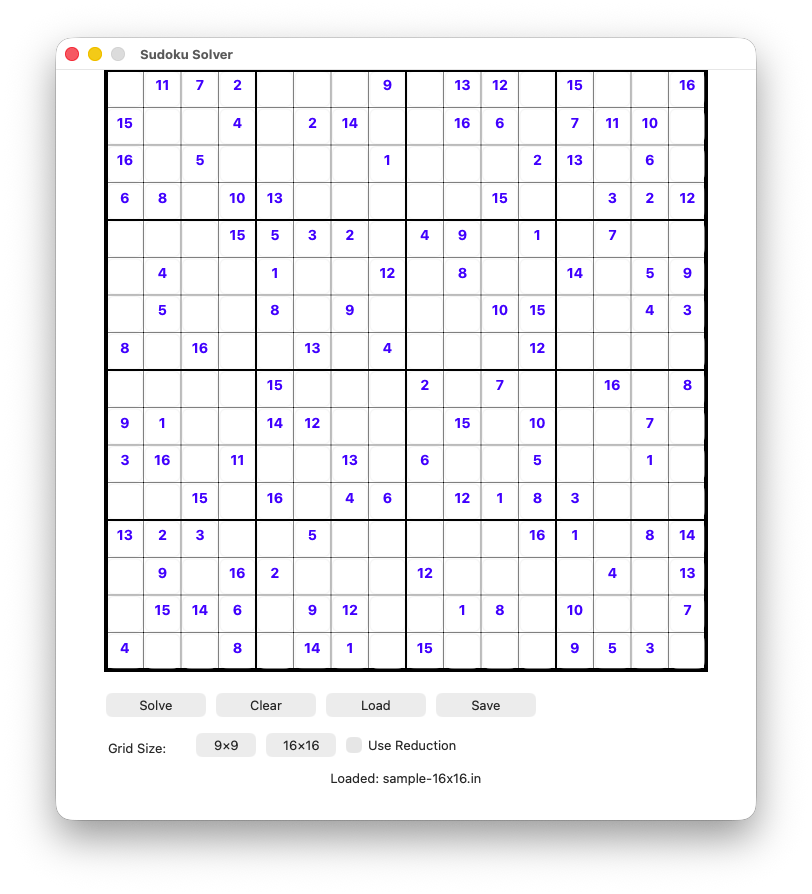

# Sudoku Solver in C

[](https://opensource.org/licenses/MIT)
[](https://github.com/yourusername/pbsudoku-c)
[](https://en.wikipedia.org/wiki/C_(programming_language))
[](https://developer.apple.com/documentation/appkit)

A high-performance Sudoku solver written in C that supports both standard 9×9 and larger 16×16 puzzles using backtracking with optional constraint propagation optimization.

**Now with native macOS GUI!** 🎉

## Table of Contents
- [Features](#features)
- [Quick Start](#quick-start)
- [GUI Application](#gui-application)
- [Algorithm Overview](#algorithm-overview)
- [Architecture](#architecture)
- [Usage](#usage)
- [Input Format](#input-format)
- [Testing](#testing)
- [Performance](#performance)

## Features

✅ Solves 9×9 Sudoku puzzles (default)
✅ Supports 16×16 Sudoku puzzles
✅ Backtracking algorithm with constraint checking
✅ Optional reduction/constraint propagation optimization
✅ Command-line interface with multiple options
✅ **Native macOS GUI application** 🆕
✅ Comprehensive test suite included
✅ Performance timing built-in

## Quick Start

### Build Command-Line Solver
```bash
make
```

### Build GUI Application (macOS only)
```bash
make gui
```

### Build macOS App Bundle (with custom icon)
```bash
make app
```

### Run Command-Line
```bash
# Solve a 9×9 puzzle
./sudoku_solver -i tests/test1.in -o solution.out

# Solve with reduction optimization
./sudoku_solver -i tests/test1.in -o solution.out -r

# Solve a 16×16 puzzle
./sudoku_solver -i tests/sample-16x16.in -o solution.out -s 4
```

### Run GUI Application
```bash
# Run executable directly
./sudoku_gui

# Or launch as macOS app (with custom icon)
open SudokuSolver.app
```

### Test
```bash
make test
```

### Clean
```bash
make clean
```

## GUI Application

A native macOS graphical interface is now available! See [GUI_README.md](GUI_README.md) for detailed documentation.

### Screenshots

<div align="center">

#### Main Window

*Empty 9×9 grid ready for input*

#### Puzzle Loaded

*Puzzle loaded from file with original clues in blue*

#### Puzzle Solved

*Solved puzzle with solutions in black*

#### 16×16 Puzzle Support

*Large puzzle support with the same intuitive interface*

</div>

### Features
- 🖱️ Interactive grid with click-to-edit cells
- ✏️ **Manual puzzle creation** - no input file needed!
- 🔒 Lock clues to mark starting positions
- 🔢 Support for both 9×9 and 16×16 puzzles
- 📁 Load and save puzzle files
- ⚡ Optional reduction optimization
- ⏱️ Real-time solve timing
- 🎨 Color-coded cells (blue for clues, black for solutions)

### Quick GUI Usage

**Create a puzzle manually:**
1. Launch: `./sudoku_gui`
2. Select grid size (9×9 or 16×16)
3. Click cells and enter starting numbers
4. Click "Lock Clues" to mark them as original (turns blue)
5. Click "Solve" to see the solution
6. Click "Save" to save your puzzle

**Or load an existing puzzle:**
1. Launch: `./sudoku_gui`
2. Click "Load" and select a puzzle file
3. Click "Solve" to see the solution

For complete GUI documentation, see [GUI_README.md](GUI_README.md).

## Algorithm Overview

The solver uses a **backtracking algorithm** with optional **constraint propagation** (reduction).

### Backtracking Flow

```
┌─────────────────────────────────────────────────────────────┐
│                    Start: solve_puzzle(0,0)                 │
└────────────────────────────┬────────────────────────────────┘
                             │
                             ▼
                    ┌────────────────┐
                    │ Reached end?   │
                    │ (row == size)  │
                    └────┬───────┬───┘
                         │       │
                    Yes  │       │  No
                         │       │
                         ▼       ▼
                    ┌────────┐  ┌──────────────────┐
                    │ SOLVED │  │ Current cell     │
                    │ Return │  │ already filled?  │
                    │  true  │  └────┬─────────┬───┘
                    └────────┘       │         │
                                Yes  │         │  No
                                     │         │
                                     ▼         ▼
                            ┌────────────┐  ┌─────────────────┐
                            │ Move to    │  │ Try values 1..N │
                            │ next cell  │  └────────┬────────┘
                            └────────────┘           │
                                                     ▼
                                            ┌─────────────────┐
                                            │ For each value: │
                                            │ 1. Place value  │
                                            │ 2. Check valid  │
                                            │ 3. Recurse      │
                                            └────┬────────┬───┘
                                                 │        │
                                            Valid│        │Invalid
                                                 │        │
                                                 ▼        ▼
                                          ┌──────────┐  ┌──────────┐
                                          │ Continue │  │ Backtrack│
                                          │ solving  │  │ (reset=0)│
                                          └──────────┘  └──────────┘
```

### Constraint Checking

For each value placement, the solver validates three constraints:

```
┌─────────────────────────────────────────────────────────────┐
│              can_place(puzzle, row, col, val)               │
└────────────────────────────┬────────────────────────────────┘
                             │
                             ▼
              ┌──────────────┴──────────────┐
              │                             │
              ▼                             ▼
    ┌──────────────────┐         ┌──────────────────┐
    │  is_row_ok()?    │         │  is_col_ok()?    │
    │                  │         │                  │
    │ Check if value   │         │ Check if value   │
    │ exists in row    │         │ exists in column │
    └────────┬─────────┘         └────────┬─────────┘
             │                            │
             └──────────┬─────────────────┘
                        │
                        ▼
              ┌──────────────────┐
              │  is_sqr_ok()?    │
              │                  │
              │ Check if value   │
              │ exists in 3×3 or │
              │ 4×4 sub-grid     │
              └────────┬─────────┘
                       │
                       ▼
              ┌──────────────────┐
              │ All checks pass? │
              │   Return true    │
              └──────────────────┘
```

### Optional Reduction (Constraint Propagation)

When `-r` flag is used, the solver first applies constraint propagation:

```
┌─────────────────────────────────────────────────────────────┐
│                    reduce_puzzle()                          │
│                                                             │
│  For each empty cell:                                       │
│    For each possible value (1..N):                          │
│      If this is the ONLY cell in its sub-grid               │
│      where this value can be placed:                        │
│        → Fill it immediately                                │
│        → Repeat until no more reductions possible           │
└─────────────────────────────────────────────────────────────┘
```

**Benefits:**
- Reduces search space significantly
- Fills "obvious" cells before backtracking
- Can dramatically improve solve time for easier puzzles

## Architecture

### Project Structure

```
pbsudoku_c_bob/
├── sudoku_solver.c       # Main implementation
├── sudoku_solver.h       # Header with function declarations
├── Makefile              # Build configuration
├── README.md             # This file
└── tests/
    ├── run_tests.sh      # Test runner script
    ├── test1.in          # 9×9 test puzzle
    ├── test1.expected    # Expected solution
    ├── test1.red         # Test with reduction
    ├── sample-16x16.in   # 16×16 test puzzle
    └── ...               # More test cases
```

### Code Organization

```
┌─────────────────────────────────────────────────────────────┐
│                     sudoku_solver.h                         │
│  ┌───────────────────────────────────────────────────────┐  │
│  │ Constants:                                            │  │
│  │  • DEFAULT_N = 3 (for 9×9)                           │  │
│  │  • MAX_N = 4 (supports up to 16×16)                  │  │
│  │  • TO_FILL = 0 (empty cell marker)                   │  │
│  └───────────────────────────────────────────────────────┘  │
│  ┌───────────────────────────────────────────────────────┐  │
│  │ Function Declarations:                                │  │
│  │  • I/O: read_puzzle, write_puzzle                    │  │
│  │  • Solving: solve_puzzle, reduce_puzzle              │  │
│  │  • Validation: can_place, must_place                 │  │
│  │  • Constraints: is_row_ok, is_col_ok, is_sqr_ok     │  │
│  └───────────────────────────────────────────────────────┘  │
└─────────────────────────────────────────────────────────────┘
                             │
                             ▼
┌─────────────────────────────────────────────────────────────┐
│                     sudoku_solver.c                         │
│  ┌───────────────────────────────────────────────────────┐  │
│  │ main()                                                │  │
│  │  • Parse command-line arguments                      │  │
│  │  • Read puzzle from file                             │  │
│  │  • Apply reduction (if -r flag)                      │  │
│  │  • Solve puzzle                                      │  │
│  │  • Write solution to file                            │  │
│  │  • Report timing                                     │  │
│  └───────────────────────────────────────────────────────┘  │
│  ┌───────────────────────────────────────────────────────┐  │
│  │ Core Algorithm Functions                             │  │
│  │  • solve_puzzle(): Recursive backtracking            │  │
│  │  • reduce_puzzle(): Constraint propagation           │  │
│  │  • can_place(): Validate placement                   │  │
│  │  • must_place(): Check if value must go here        │  │
│  └───────────────────────────────────────────────────────┘  │
│  ┌───────────────────────────────────────────────────────┐  │
│  │ Helper Functions                                      │  │
│  │  • is_row_ok(), is_col_ok(), is_sqr_ok()            │  │
│  │  • read_puzzle(), write_puzzle()                     │  │
│  │  • print_help()                                      │  │
│  └───────────────────────────────────────────────────────┘  │
└─────────────────────────────────────────────────────────────┘
```

### Data Structures

```c
// Global puzzle size (N=3 for 9×9, N=4 for 16×16)
int N = DEFAULT_N;

// Puzzle grid: 2D array with maximum size 16×16
int puzzle[MAX_SIZE][MAX_SIZE];

// Cell values:
//   0 = empty (TO_FILL)
//   1..9 = values for 9×9 puzzle
//   1..16 = values for 16×16 puzzle
```

## Usage

### Command-Line Options

```bash
./sudoku_solver -i <input_file> -o <output_file> [options]
```

| Option | Long Form | Description | Default |
|--------|-----------|-------------|---------|
| `-i` | `--input` | Input puzzle file path | Required |
| `-o` | `--output` | Output solution file path | Required |
| `-r` | `--reduce` | Apply reduction before solving | Disabled |
| `-s` | `--size` | Puzzle size (3 or 4) | 3 (9×9) |
| `-h` | `--help` | Show help message | - |

### Examples

```bash
# Basic 9×9 solve
./sudoku_solver -i puzzle.txt -o solution.txt

# 9×9 with reduction optimization
./sudoku_solver -i puzzle.txt -o solution.txt -r

# 16×16 puzzle
./sudoku_solver -i big_puzzle.txt -o big_solution.txt -s 4

# 16×16 with reduction
./sudoku_solver -i big_puzzle.txt -o big_solution.txt -s 4 -r
```

## Input Format

### 9×9 Puzzle Format
```
5 3 0 0 7 0 0 0 0
6 0 0 1 9 5 0 0 0
0 9 8 0 0 0 0 6 0
8 0 0 0 6 0 0 0 3
4 0 0 8 0 3 0 0 1
7 0 0 0 2 0 0 0 6
0 6 0 0 0 0 2 8 0
0 0 0 4 1 9 0 0 5
0 0 0 0 8 0 0 7 9
```

- 9 lines with 9 space-separated integers
- Values: 0-9 (0 = empty cell)

### 16×16 Puzzle Format
```
0 0 0 0 0 0 0 0 0 0 0 0 0 0 0 0
0 0 0 0 0 0 0 0 0 0 0 0 0 0 0 0
...
```

- 16 lines with 16 space-separated integers
- Values: 0-16 (0 = empty cell)

## Testing

The project includes a comprehensive test suite:

```bash
# Run all tests
make test

# Or manually
cd tests && ./run_tests.sh
```

### Test Cases

| Test | Description | Size |
|------|-------------|------|
| `test1` | Basic 9×9 puzzle | 9×9 |
| `test2` | Medium difficulty 9×9 | 9×9 |
| `test3-6` | Various 9×9 puzzles | 9×9 |
| `sample-16x16` | Large puzzle | 16×16 |

Each test includes:
- `.in` - Input puzzle
- `.expected` or `.out` - Expected solution
- `.red` - Reduction test variant (some tests)

## Performance

### Time Complexity
- **Worst case**: O(N^(N²)) where N is the puzzle size
- **Average case**: Much better due to constraint checking and pruning
- **With reduction**: Significantly improved for easier puzzles

### Space Complexity
- O(N²) for the puzzle grid
- O(N²) for recursion stack in worst case

### Typical Solve Times
- **9×9 puzzles**: < 0.01 seconds (most cases)
- **16×16 puzzles**: 0.01 - 1 second (varies by difficulty)
- **With reduction**: Often 2-10× faster

### Optimization Flags
The Makefile uses `-O3` optimization for maximum performance:
```makefile
CFLAGS = -Wall -O3
```

## Algorithm Complexity Analysis

### Backtracking Search Space

For a 9×9 Sudoku:
```
Empty cells: ~40-60 (typical puzzle)
Branching factor: 1-9 per cell
Search space: Exponential, but heavily pruned by constraints
```

### Constraint Checking Cost

Per placement attempt:
```
Row check:    O(N) - scan row
Column check: O(N) - scan column  
Square check: O(N) - scan sub-grid
Total:        O(N) per validation
```

### Reduction Optimization

```
For each value (1..N):
  For each cell (N²):
    Check if must_place: O(N)
Total per iteration: O(N³)
Iterations: Typically 1-5 for solvable puzzles
```

## Contributing

When contributing, please:
1. Follow the existing code style
2. Add tests for new features
3. Update this README if adding new functionality
4. Ensure `make test` passes

## License

This project is provided as-is for educational purposes.

## Author

Created as a demonstration of backtracking algorithms and constraint satisfaction problems in C.